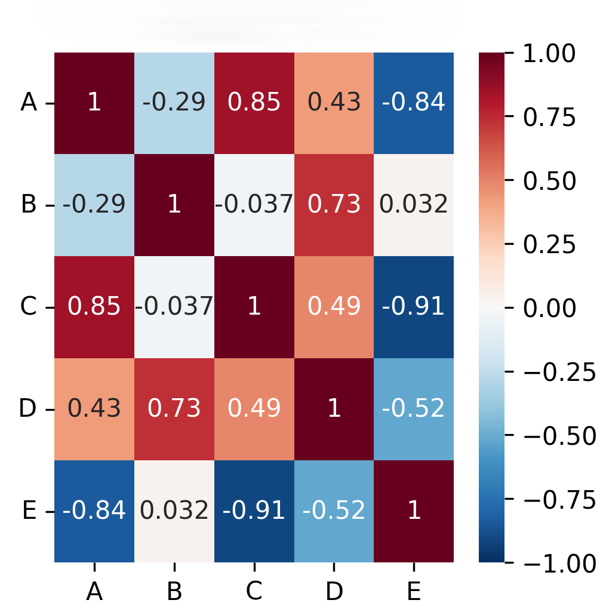
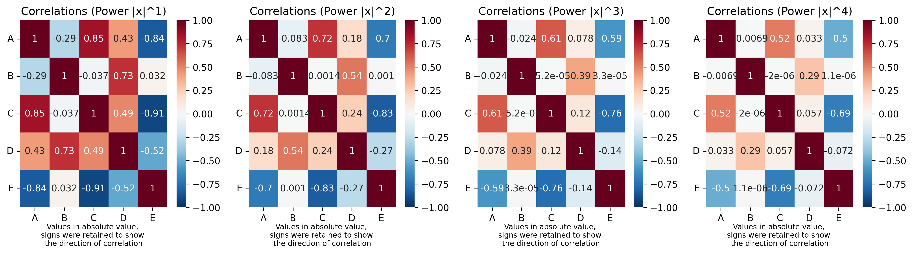

# WGCNA: From Gene Expression to Functional Co-expression Networks

### Introduction to Network Biology

Biological systems are frequently represented as **networks**, which are complex sets of binary interactions or relations between different entities. Network biology applies **graph theory** tools to represent and analyze these systems. In this context, **nodes** represent entities like proteins or genes, and **edges** convey information about the links between them. Networks can have different types of edges: **undirected**, **directed**, or **weighted**.

Common types of biological networks include protein-protein interaction networks, metabolic networks, genetic interaction networks, gene/transcriptional regulatory networks, cell signaling networks, and **gene co-expression networks**. Gene co-expression networks are primarily associated with **Transcriptomics** data, such as RNA-seq or Microarrays.

### WGCNA: A Standard Tool for Co-expression Networks

**WGCNA (Weighted Gene Co-expression Network Analysis)** is a standard tool used to construct co-expression networks from gene expression data. It is "Weighted" because it uses **continuous edge weights ($[0, 1]$)**, "Correlation-based" as it utilizes Pearson/Spearman correlations, and designed for "Scale-free topology". WGCNA is **noise-robust** due to the use of Topological Overlap Matrix (TOM) and is **scalable** for large datasets. A key limitation is that it infers **no causality** and can be sensitive to batch effects. Co-expression networks are typically **undirected** (symmetric gene relationships).

### WGCNA Workflow

The WGCNA workflow transforms expression data into networks through a series of steps:

1. **Expression Matrix ($X$) Preprocessing**
    
    - **Input**: A matrix of gene expression values (e.g., RNA-seq counts).
    - **Preprocessing**: Normalization (e.g., VST, Rlog, CPM, TMM, or $\log\_2(\mathrm{TPM}+1))$ and filtering of low-variance genes.
    - **Output**: A cleaned matrix $X$ where $X_{i,s}$ (expression of gene $i$ in samples $s$).
    - **Formula**:  
        $X = [X_{i,s}], \quad i = 1, \dots, n, \quad s = 1, \dots, m$

        where $n$ is the number of genes, $m$ is the number of samples.

        Example of a expression matriz before and after preprocessing: 

        **Raw counts**
        | **Raw Count Matrix** | S1  | S2  | S3  | S4  | S5  |
        | -------------------- | --- | --- | --- | --- | --- |
        | Gene A               | 0   | 3   | 1   | 1   | 0   |
        | Gene B               | 0   | 0   | 2   | 1   | 1   |
        | Gene C               | 0   | 4   | 2   | 0   | 0   |
        | Gene D               | 0   | 0   | 1   | 1   | 0   |
        | Gene E               | 1   | 0   | 0   | 0   | 1   |

        **Processed expression matrix**
        | **Normalized Expression Matrix** | S1  | S2  | S3  | S4  | S5  |
        | -------------------------------- | --- | --- | --- | --- | --- |
        | Gene A                           | 4.7 | 5.3 | 6.3 | 5.2 | 5.1 |
        | Gene B                           | 4.7 | 4.7 | 5.5 | 5.1 | 4.7 |
        | Gene C                           | 4.5 | 4.9 | 4.7 | 5.0 | 4.9 |
        | Gene D                           | 5.2 | 4.4 | 5.5 | 6.4 | 5.6 |

2. **Correlation Matrix ($R$)**
    
    - **Computation**: Pairwise correlations between genes are calculated to measure co-expression. **Pearson correlation** is commonly used.
    - **Formula**:  

        $r_{ij} = \frac{\text{cov}(X_i, X_j)}{\sigma_{X_i} \sigma_{X_j}}$

        where $x_{ik}$ is the expression of gene $i$ in condition $k$, $\bar{x}_i$ is the mean expression of gene $i$, and $n$ is the number of conditions.
    - **Output**: A symmetric $n \times n$ matrix $R = [r_{ij}]$, where $r_{ij} \in [-1, 1]$.
    
    Example of a correlation matrix (*R*):
    

3. **Adjacency Matrix ($A$)**
    
    - **Transformation**: Correlations are transformed into **weighted connections** using a **power function ($\beta$)**. This is known as **soft-thresholding**, which highlights strong connections and reduces the impact of weak correlations.
    - **Formula**:  

        $a_{ij} = |\text{cor}(X_i, X_j)|^\beta$

        where $\theta$ is chosen to achieve **scale-free topology**.
    - **Output**: A symmetric $n \times n$ matrix $A = [a_{ij}]$, where $a_{ij} \in [0, 1]$.
    
    Exemplification of a adjacency matrix (*A*) calculation:
    

4. **Topological Overlap Matrix (TOM)**
    
    - **Measure of Similarity**: TOM measures the **topological similarity** between genes, considering not only direct connections but also the **number of shared neighbors**. This helps in **reducing noise** from spurious correlations.
    - **Formula**:  

        $TOM_{ij} = \dfrac{\sum_{u \ne i,j} a_{iu} a_{uj} + a_{ij}}{\min(k_i, k_j) + 1 - a_{ij}}$

        where $\sum_{u \neq i,j} a_{iu}a_{uj}$ represents shared neighbors; $k_i = \sum_u a_{iu}$ is connectivity of gene $i$.
    - **Output**: A symmetric $n \times n$ matrix $TOM = [TOM_{ij}]$, where $TOM_{ij} \in [0, 1]$.
    
    Exemplification of a Network with Topological Overlap Matrix (TOM) simulation of i-j connections:
    

5. **Dissimilarity TOM (dissTOM)**
    
    - **Transformation for Clustering**: The $TOM$ matrix is converted into a dissimilarity measure for easier clustering.
    - **Formula**:  

        $dissTOM_{ij} = 1 - TOM_{ij}$

    - **Output**: A symmetric $n \times n$ matrix $\mathrm{dissTOM} = [dissTOM_{ij}]$, where $dissTOM_{ij} \in [0, 1]$.

6. **Clustering Modules**
    
    - **Hierarchical Clustering**: $\text{dissTOM}$ is used as a distance measure for hierarchical clustering, constructing a dendrogram.
    - **Dynamic Tree Cutting**: This method identifies **modules** (groups of genes with low $\text{dissTOM}$) based on parameters like $\text{minModuleSize}$ and $\text{deepSplit}$. Genes with low $\text{dissTOM}$ (high $TOM$) are clustered together.
    - **Eigengene Calculation**: For each module, a **module eigengene (ME)** is calculated. The $ME$ is the **first principal component (PC1)** of the expression profiles of all genes within that module. It **summarizes the module's overall expression pattern** in a single vector, capturing the dominant trend of gene expression.
    - **Formula**:  

        $ME = \sum_{i \in \text{module}} w_i X_i$

        where $w_i$ are PCA loadings, $X_i$ are standardized expressions.
    - **Module Merging**: Modules can be merged if their eigengenes are highly correlated (e.g., $>0.75$, **corresponding to $\text{mergeCutHeight}=0.25$**).
    
    Exemplification of module formation:
    

### Module Analysis and Trait Correlation

After module detection, WGCNA allows for the **correlation of module eigengenes with external biological traits** (e.g., disease status, treatment) to identify biologically relevant modules. Modules highly correlated with a trait are likely involved in that trait's biology.

Key concepts for assessing gene importance within modules and their relation to traits are:

- **Gene Significance ($GS$)**: Measures how strongly a gene's expression correlates with a specific trait.
    - **Formula**: 

        $GS_i = \left| \text{cor}(X_i, \text{trait}) \right|$

- **Module Membership ($MM$)**: Quantifies how central a gene is to its module by measuring the correlation between a gene's expression and its module's eigengene.
    - **Formula**: 

        $MM_i = \left| \text{cor}(X_i, ME_{\text{module}}) \right|$

    - Genes with **high $GS$ and high $MM$** in a trait-correlated module are considered key candidates for biological roles.
- **Hub Genes**: These are genes that are **highly connected within a module**. They are identified by selecting genes with high $MM$ (e.g., top 10%) or high **intramodule connectivity**. Hub genes are often functionally important, such as transcription factors in biological pathways.
    - **Intramodule Connectivity Formula**:  

        $k_{\text{within},i} = \sum_{\substack{j \in \text{module} \\ j \neq i}} a_{ij}$

        $k_{\text{within},i} = \sum_{j \in \text{module}, j \neq i} a_{ij}$

        (**within-module, vs. total $k_i = \sum_j a_{ij}$**)
        
        Example of a network with hub genes identified:
        
        
### Biological Interpretation

Once modules and hub genes are identified, further biological insights can be gained through:

- **Gene Ontology (GO) enrichment analysis**.
- **Identification of transcription factors**.
- **KEGG pathways overrepresentation**.
- **Functional annotation** (e.g., BLAST) and **domains/motifs identification**.

### Network Visualization

Network visualization tools are used to represent the inferred networks. Common steps include:

1. **Exporting** node (genes with $MM$, $GS$) and edge (adjacency/TOM) files.
2. **Visualizing** networks, often coloring nodes by module or connectivity.
3. **Annotating** with functional terms (e.g., GO/KEGG).

Tools for WGCNA network visualization and analysis include **Cytoscape**, igraph, NetworkX, Graph-tool, Gephi, and specialized WGCNA modules in platforms like Omics Playground or PyWGCNA.

### WGCNA Applications

WGCNA is widely applied across various scientific and biological systems. Examples include:

- **Animal Science**: Identifying hub genes in bovine mammary glands during lactation.
- **Human Health (Oncology)**: Clustering differentially expressed genes (DEGs) into modules and identifying hub genes linked to prognosis in cancers like human tongue squamous cell carcinoma, oral squamous cell carcinoma, osteosarcoma, and lung adenocarcinoma. It has also been used with microbiome data in tumor contexts.
- **Comparative Genomics**: Comparing WGCNA networks across human and mouse tissues to identify conserved gene roles.
- **Plant Biology**: Identifying hub genes related to pathogen resistance in cassava, drought tolerance in maize, **and somatic embryogenesis in Arabidopsis**.

### Co-expression Networks vs. Regulatory Networks

It is crucial to distinguish between **co-expression networks** and **gene regulatory networks**:

- **Co-expression Networks**: Edges are based on **correlation of expression profiles**, implying **no causality**. They are **undirected** and group genes with similar expression patterns.
- **Regulatory Networks**: Edges represent **causal interactions** (e.g., a transcription factor binding to a gene promoter). They are **directed** and model mechanistic control. Inference often relies on binding data or motif databases. Tools like ARACNe, GENIE3, and SCENIC are used for regulatory network inference.

Both network types share similarities: they represent biological relationships as graphs, identify functional modules, are data-driven, and utilize visualization tools.

